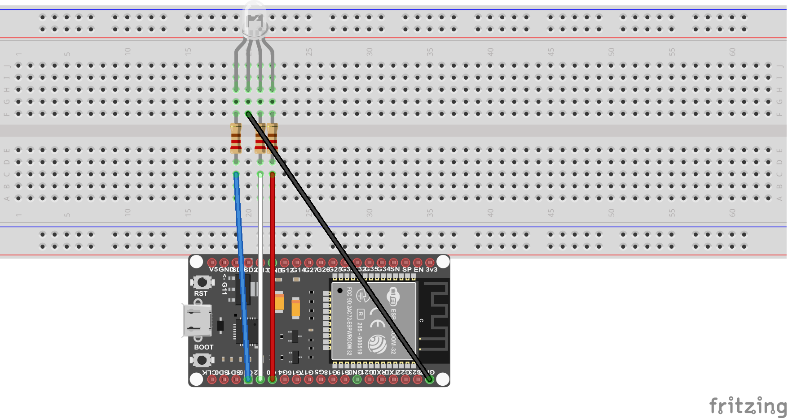
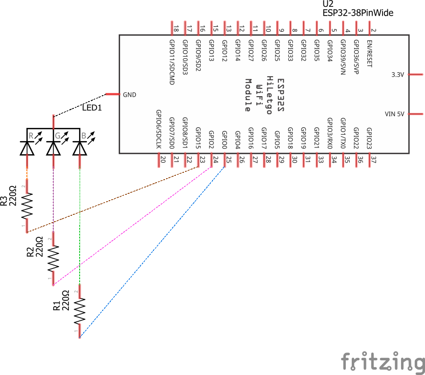

# Rapport TP2 Partie 1

## Schéma Fritzing

### Schéma de montage

Schéma de l'ESP32 relié a une LED RVB avec 3 résistance.

### Schéma électrique

Schéma électrique du montage ci-dessus.

Pin 23, 24, 25 en sortie de l'ESP32 et la LED RVB relié au GND.

